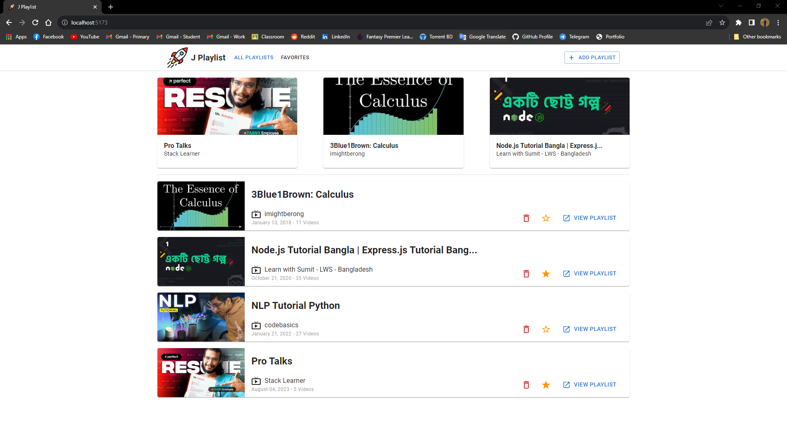
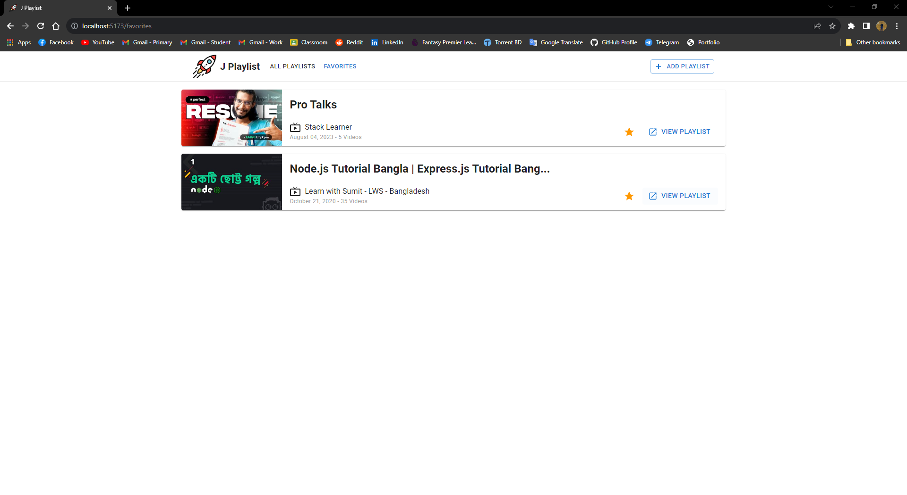
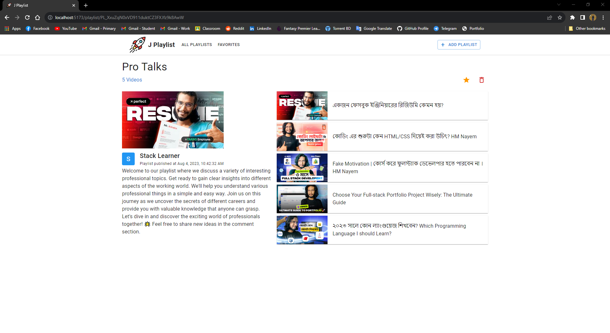

# J Playlist

The YouTube video suggestion system makes watching a collection of videos distracting. In this application, users can watch videos (entire playlists) just like on online educational websites. Playlists can be added to users’ accounts and played directly from this application without any interruptions. I used YouTube Data API for getting the video playlist’s information.

## Running the Application

To run the application on your localhost just run the following commands in your terminal (for Powershell/Git bash).

```shell
git clone https://github.com/JanayAlam/j-playlist.git
cd j-playlist
copy default.env .env
```

Now you need google developer api key for running the application. Go to [Google Developer Console](https://console.cloud.google.com) and create a new project or select a existing project. Enable 'YouTube Data API v3' API. If an API key hasn't already been created, do so now and copy the key. Now write the key in `.env` file (replace VITE_YOUTUBE_DATA_API_KEY's value).

Now run the following commands to install the required packages and run the application.

```shell
yarn
yarn run dev
```

Keep in mind that yarn and nodejs must be installed on your machine.

## Application Demo

The functionalities and pages of the application are described and shown below.

### Empty Homepage

At first, there will not be any playlist to show.


### Adding Playlist

By clicking `Add Playlist` button you can add a new playlist. Playlist id or link is required to add a new playlist.


### Homepage after Adding Multiple Playlists

Most three recent playlist is shown in the beginning of the homepage. All added playlists will be shown below this section.



### Favorite Playlists

Favorite playlists will be on this page.



### Playlist Details

In this page, you will get whole information of the playlist.



### Video Page

On top, you can watch the video. below that, you will find a group of three buttons. Previous, Show List of Videos, and Next video button. At last, show/hide video description button is placed. This page was designed to watch a video without distraction.


### Video List of a Playlist from Video Page

You can see the list of videos of an specific playlist (currently selected playlist). The light orange color indicates that the video is currently selected.


### Deleting a Playlist

You can delete a playlist from playlist description page and homepage. Clicking `Delete` button will remove the playlist from local storage.


